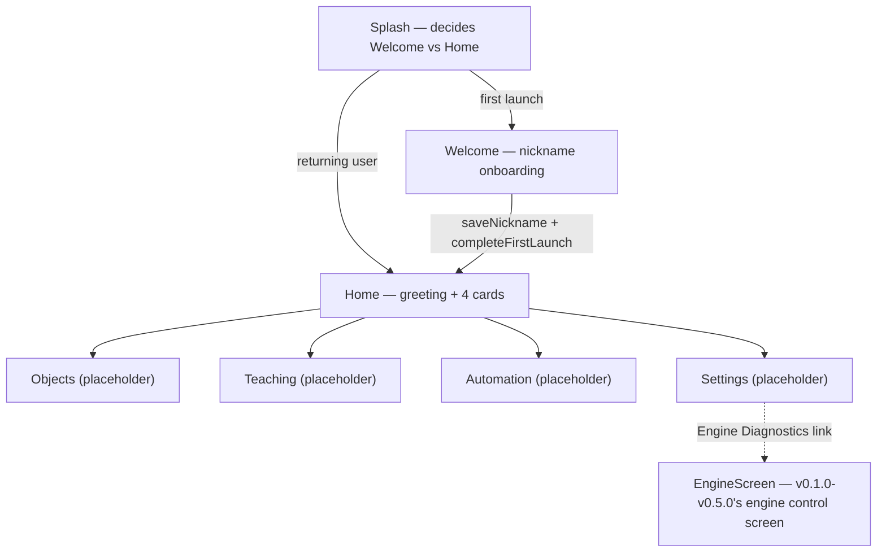
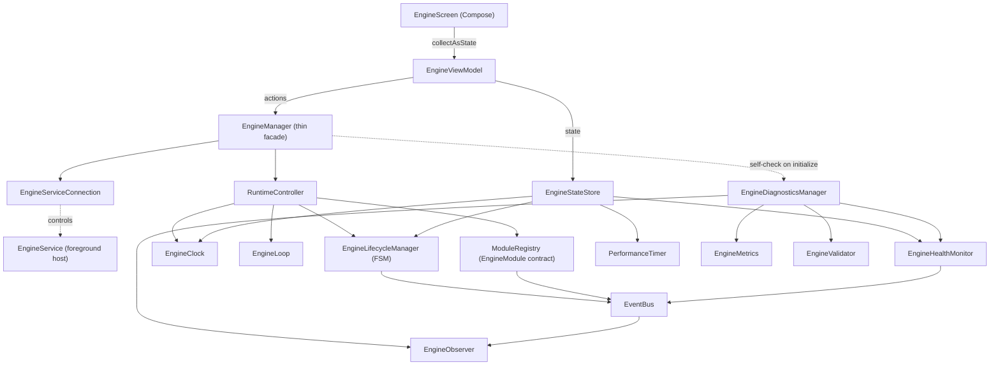

# Behavior Engine — v0.6.0 Product Foundation

A Visual Behavior Engine for Android. v0.1.0–v0.5.0 built and froze the engine (lifecycle, tick
loop, modules, background service, diagnostics) — that work is complete and untouched this phase.
**v0.6.0 starts building the actual product**: first-launch onboarding, a local nickname profile,
and the real navigation shell (Home hub → Objects / Teaching / Automation / Settings). No visual
recognition, AI, object detection, Accessibility, or MediaProjection yet — only the UX and product
flow those features will eventually live inside.

## Opening the project

This project was generated outside Android Studio, so the Gradle wrapper's binary launcher
(`gradle/wrapper/gradle-wrapper.jar`, `gradlew`, `gradlew.bat`) is not included — binary files
can't be authored as text. `gradle/wrapper/gradle-wrapper.properties` already pins the intended
version (Gradle 8.9). Regenerate the launcher one of two ways:

1. Open the project in a recent Android Studio (Ladybird/Meerkat or newer) — it detects the
   missing wrapper and offers to generate it automatically on sync.
2. Or, with a local Gradle install: `gradle wrapper --gradle-version 8.9` from the project root.

Requires JDK 17 and Android SDK Platform 35 (installed via Android Studio's SDK Manager).

## Product navigation flow (new in v0.6.0)



Only Home and Welcome are fully designed this phase; Objects/Teaching/Automation/Settings are
simple placeholders (`core/presentation/common/PlaceholderScreen.kt`). `EngineScreen` is
deliberately *not* part of the main flow — it's the fully-functional engine status/control
screen from prior phases, relocated (not deleted) so end users of a visual-automation product
aren't shown raw tick counts by default, while the tested functionality stays reachable from
Settings instead of becoming dead code.

## Why routing lives in Splash, not MainActivity

`SplashViewModel` reads `UserProfileRepository.awaitProfile()` — a one-shot suspend read — rather
than the cached `profile: StateFlow<UserProfile>`. That StateFlow's `SharingStarted.Eagerly`
default means its *very first* value is `UserProfile()` defaults (`hasCompletedFirstLaunch =
false`) until the real DataStore read lands a moment later; routing off that cached value would
flash Welcome at a returning user for a frame. `awaitProfile()` exists specifically to give the
one call site that makes an irreversible navigation decision the *correct* value, not the
convenient one.

## Local storage: UserProfile

```
core.domain.profile.UserProfile           // nickname, createdAtMillis, hasCompletedFirstLaunch, reserved
core.domain.profile.UserProfileRepository // interface: profile, awaitProfile(), saveNickname(), completeFirstLaunch()
core.data.profile.UserProfileRepositoryImpl // DataStore-backed — the first real use of core.data,
                                            // reserved since v0.1.0 for exactly this
```

Backed by its own Preferences DataStore file (`user_profile`, qualified `@ProfileDataStore`),
separate from `settings/SettingsManager`'s (`behavior_engine_settings`, `@SettingsDataStore`) —
user identity and app configuration are unrelated concerns that happen to both fit Preferences
DataStore. No login, no email, no network call: the nickname *is* the entire local identity
system, per this phase's product vision.

## Engine architecture (unchanged since v0.5.0)



`EngineViewModel`/`EngineScreen` are `HomeViewModel`/`HomeScreen` renamed — same code, same
tested behavior — since "Home" now names the product's navigation hub instead.

## Package structure

```
com.behaviorengine
├── core
│   ├── common        // App-wide infra: AppConstants, LoggerManager, ConfigManager
│   ├── data
│   │   └── profile    // UserProfileRepositoryImpl (DataStore) — core.data's first real content
│   ├── domain
│   │   ├── engine     // Every engine contract (unchanged since v0.5.0)
│   │   └── profile    // UserProfile, UserProfileRepository
│   └── presentation
│       ├── splash     // Routing: Welcome vs Home
│       ├── welcome    // Onboarding (new)
│       ├── home       // Product hub: greeting + 4 cards (new content, same package name)
│       ├── objects    // Placeholder (new)
│       ├── teaching   // Placeholder (new)
│       ├── automation // Placeholder (new)
│       ├── settings   // Placeholder + Engine Diagnostics link
│       ├── engine     // EngineScreen/EngineViewModel — formerly core.presentation.home (new)
│       └── common     // PlaceholderScreen, shared by Objects/Teaching/Automation/Settings
├── engine             // Concrete implementations of every core.domain.engine interface
├── vision             // (future) screen capture / frame acquisition
├── recognition        // (future) OCR + visual element recognition
├── world              // (future) structured "what's on screen" model
├── behavior           // (future) rules / actions / feedback
├── memory             // (future) persisted history for learning to train on
├── learning           // (future) adapts rules/decisions over time
├── automation         // (future) executes actions against the device
├── accessibility      // (future) AccessibilityService integration
├── services           // EngineService (foreground host); future AccessibilityService lives here too
├── settings           // AppSettings model + DataStore prep (no persistence yet — distinct from profile)
├── utils              // Small pure-function helpers (time/number formatting)
├── di                 // Hilt modules + qualifiers
├── navigation         // Navigation Compose graph + route definitions
└── ui/theme           // Compose dark theme, typography, color tokens
```

## Animations

One shared fade+slide transition applied once at the `NavHost` level (`enterTransition` /
`exitTransition` / `popEnterTransition` / `popExitTransition` in `BehaviorEngineNavGraph.kt`) —
not per-screen boilerplate. Welcome additionally fades+slides its own content in on first
composition. Both are deliberately subtle per this phase's spec — no bouncing, no unnecessary
motion.

## Thread safety & cleanup notes (carried forward from v0.5.0, still accurate)

- `ModuleRegistryImpl` synchronizes all reads/writes of its module map on a private lock.
- `PerformanceTimerImpl`'s tick counters are safe only because ticks never overlap — documented
  in its KDoc as an assumption to re-check if that ever changes.
- Every other piece of shared state (engine or profile) is a `StateFlow`, whose updates are
  inherently atomic.

## What's deliberately not here

Visual recognition, AI, object detection, Accessibility, and MediaProjection are all still out of
scope — this phase only prepares the product structure they'll eventually plug into. Objects,
Teaching, Automation, and Settings have no functionality beyond navigation; there is nothing
behind those cards until `vision`/`recognition`/`behavior`/`automation` are implemented in later
phases.
