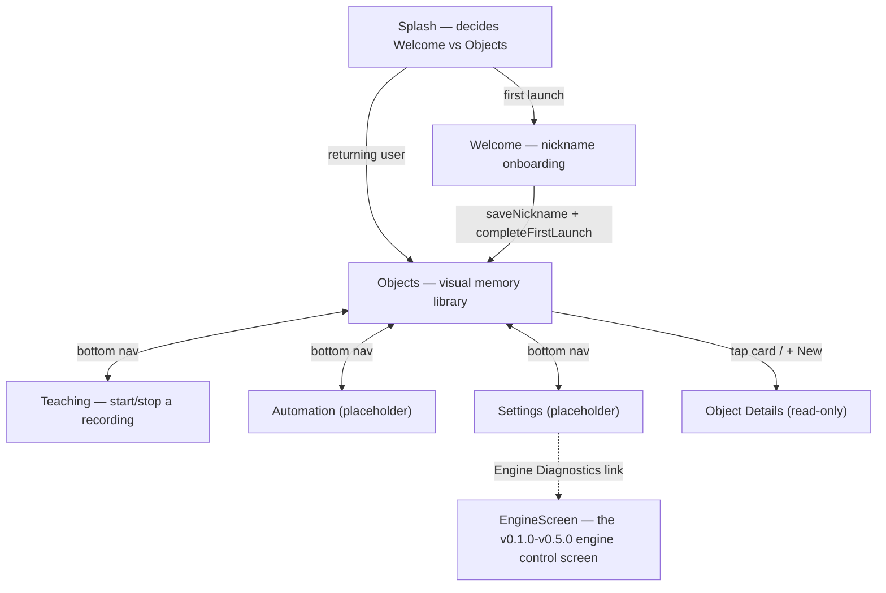
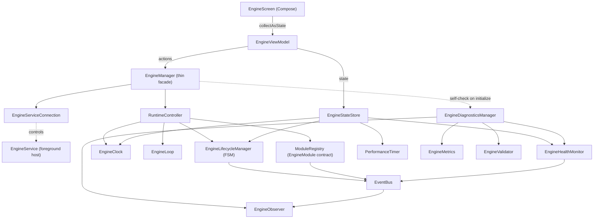

# Behavior Engine — v0.9.0 Visual Teaching Mode Foundation

A Visual Behavior Engine for Android. v0.1.0–v0.5.0 built and froze the engine; v0.6.0 built
onboarding and the navigation shell; v0.7.0 gave the product its taught-object library ("Visual
Objects"); v0.8.0 built a lifecycle-only teaching session placeholder. **v0.9.0 replaces that
placeholder with the real thing**: `MediaProjection` screen capture at 2 FPS, a floating overlay
service, and local JSON+WEBP session storage — a user can record how they use *any* app on the
device, pause/resume/finish/cancel that recording, and inspect exactly what got saved. Still no
OCR, object detection, recognition, automation, or AI — this phase only collects clean data for
those to consume later.

## Opening the project

This project was generated outside Android Studio, so the Gradle wrapper's binary launcher
(`gradle/wrapper/gradle-wrapper.jar`, `gradlew`, `gradlew.bat`) is not included — binary files
can't be authored as text. `gradle/wrapper/gradle-wrapper.properties` already pins the intended
version (Gradle 8.9). Regenerate the launcher one of two ways:

1. Open the project in a recent Android Studio (Ladybird/Meerkat or newer) — it detects the
   missing wrapper and offers to generate it automatically on sync.
2. Or, with a local Gradle install: `gradle wrapper --gradle-version 8.9` from the project root.

Requires JDK 17 and Android SDK Platform 35 (installed via Android Studio's SDK Manager).

## Product navigation flow (changed in v0.9.0)



Unlike v0.8.0, Teaching no longer navigates to a separate screen when a recording starts — the
same `TeachingScreen` just changes what it shows (idle explanation vs. live stats), since starting
a screen recording is not itself a "detail" destination to drill into.

**The v0.6.0 "Home" hub is gone.** Its only job was navigation, and a persistent bottom bar
(Objects/Teaching/Automation/Settings) is a strictly better fit for "the user should land in the
Objects workspace, not a menu screen" — so rather than preserve it the way `EngineScreen` was
preserved (which had substantial *tested behavior* worth keeping), it was removed outright.
`BehaviorEngineNavGraph` wraps the whole `NavHost` in a `Scaffold`; the bottom bar renders itself
only for `Screen.BOTTOM_NAV_ROUTES` — Splash, Welcome, Object Details, and Engine Diagnostics are
all full-screen with no bottom bar.

## The Visual Object architecture

```
core.domain.objects.VisualObject           // id, name, created/modified, status, imageCount,
                                            // recognitionEnabled, notes, reserved (AI metadata)
core.domain.objects.VisualObjectStatus     // READY / DISABLED / TRAINING / ARCHIVED
core.domain.objects.VisualObjectRepository // createObject/updateObject/deleteObject/loadObjects/searchObjects
core.data.objects.VisualObjectRepositoryImpl // in-memory only — see below
```

**In-memory, not persisted, on purpose.** This phase's spec says "prepare repository
architecture... use mock local data if necessary" — there's no image data yet to make real
persistence meaningful, and the empty-state test case (`Navigate to Objects. Empty state should
appear.`) requires the library start empty every launch anyway. A future phase backing this with
Room only has to change `VisualObjectRepositoryImpl`; every screen already goes through the
`VisualObjectRepository` interface.

`VisualObject` is `@Immutable`-annotated: without it, Compose's stability inference would flag
the class unstable purely because `reserved` is a `Map`, forcing unnecessary recomposition of
every card in `ObjectsScreen`'s `LazyColumn` on unrelated state changes. The annotation is honest
here — every mutation goes through the repository, which always publishes a new instance via
`copy()`. `kotlinx.collections.immutable` (for the `List<VisualObject>` itself) was deliberately
*not* added — `LazyColumn`'s stable `key = { it.id }` already covers this phase's real (near-zero)
scale; reaching for that library is a future option once profiling shows it matters, not a
default to apply pre-emptively.

## Objects screen

Top bar (title + subtitle), an always-visible search field, and either a premium empty state or a
`LazyColumn` of cards:

- **Empty**: a tinted circle behind an outlined icon standing in for a real illustration, copy
  drawn from the product vision ("build your own visual library") rather than a generic
  "nothing here," and a primary "New Visual Object" button.
- **Populated**: `ObjectCard` per object (name, `StatusBadge`, image count, created date,
  three-dot menu), plus a `FloatingActionButton` for adding more. Card press elevation uses
  Material3's built-in `pressedElevation` — no manual animation code needed for this phase's
  "small card elevation animation" spec point.

Object creation has no form yet: tapping "New Visual Object" creates one immediately (name
`"Visual Object #N"`) and navigates straight to its (read-only) details screen — matching the
literal test case ("Press New Visual Object → Navigate to Object Details placeholder") without
inventing a creation form the spec never asked for. The three-dot menu's "Edit" also navigates
there for the same reason: Object Details is the only "manage this object" destination that
exists yet. "Disable" is a toggle (relabels to "Enable" once disabled) rather than one-directional,
since a menu action with no way back would feel broken. Delete asks for confirmation first.

Status → color mapping (`core.presentation.common.VisualObjectStatusUi.kt`) is the one place
this can ever be defined, shared by `ObjectCard` and `ObjectDetailsScreen`:
`READY`→green, `TRAINING`→yellow, `DISABLED`→gray, `ARCHIVED`→red — exactly the four colors this
phase's spec allows.

## Teaching Mode architecture (v0.9.0)

```
core.domain.teaching.TeachingState            // Idle/Preparing/Recording/Paused/Stopping/Completed/Cancelled
core.domain.teaching.TeachingSession          // device/screen metadata, timing, running frame/touch counts
core.domain.teaching.TouchSample              // one collected touch — real MotionEvent fields
core.domain.teaching.ScreenFrame               // one captured frame's metadata (imagePath, never pixels)
core.domain.teaching.TeachingModeManager      // start/pause/resume/stop/cancel — top-level orchestrator
core.domain.teaching.SessionManager           // session lifecycle + device metadata, wraps TeachingRepository
core.domain.teaching.ScreenCaptureManager     // MediaProjection lifecycle + the 2 FPS capture loop
core.domain.teaching.TouchCollectorManager    // builds TouchSamples from MotionEvents
core.domain.teaching.OverlayManager           // the floating WindowManager overlay
core.domain.teaching.TeachingRecorder         // wires capture/touch streams into TeachingRepository
core.domain.teaching.TeachingRepository       // sessions/touches/frames read+write, backed by TeachingStorage
core.domain.teaching.TeachingStorage          // JSON+WEBP file I/O — the bottom layer
core.domain.teaching.TeachingServiceConnection // starts/stops TeachingOverlayService
core.data.teaching.*Impl                      // real implementations of all of the above
vision.ScreenCaptureManagerImpl               // the actual MediaProjection/VirtualDisplay/ImageReader code
services.TeachingOverlayService               // foreground host, type "mediaProjection"
core.common.TeachingLogger                    // named teaching log events, funneled through LoggerManager
```

**"UI → Manager → Repository → Storage → JSON Database," exactly as spec'd.**
`TeachingViewModel` only ever calls `TeachingModeManager`; that manager coordinates
`SessionManager`, `ScreenCaptureManager`, `TouchCollectorManager`, `OverlayManager`, and
`TeachingRecorder` — mirroring how `EngineManager` coordinates the engine's own subsystems without
any of them needing to know about each other.

**Only starting a recording needs the foreground service.** Android 14+ requires
`MediaProjectionManager.getMediaProjection()` to be called only while a `mediaProjection`-typed
foreground service is already promoted, so `TeachingOverlayService.onStartCommand` does exactly
that one thing (`startForeground` then `startProjection`) before handing off to the same
singleton managers `TeachingModeManagerImpl` uses everywhere else. Pause/resume/stop/cancel call
straight into those managers with no Service involved at all — there's no Android constraint on
those calls, so routing them through the Service would just be indirection for its own sake.

**`currentSession`/`currentState` are derived, never separately mutated.** `TeachingModeManagerImpl`
tracks only "which session id is current"; both StateFlows are `combine()`d from
`TeachingRepository.sessions` (which every real mutation writes through). Whichever component
actually changes something — the Service starting capture, or the manager pausing it — the UI and
the overlay can never observe a stale state, because there's only one source of truth to read from.

**Touch collection is honestly scoped to the overlay's own controls.** Capturing raw touch
coordinates system-wide, on whatever app the user is teaching on, needs either root, a
system-signature permission, or (Android 14+) an `AccessibilityService` declaring
`FLAG_REQUEST_MOTION_EVENTS` — none of which are in this phase's permission list, and the last one
needs a manual user opt-in in system Accessibility settings this spec never mentions. Every touch
this phase *does* collect (dragging the overlay bubble, tapping its Pause/Stop/Cancel buttons) is
a completely real `MotionEvent` — genuine pressure, size, pointer count, action — written straight
to `session.json`. A future phase adding system-wide capture only has to feed more samples through
the same `TouchCollectorManager.recordTouch`, per the "modular... without refactoring" requirement.

**Frames are written to disk immediately, never buffered in memory.** `ScreenCaptureManagerImpl`
captures a `VirtualDisplay`/`ImageReader` frame every 500ms, converts it to WEBP
(`Bitmap.CompressFormat.WEBP_LOSSY` on API 30+, legacy `WEBP` below that), and every `Bitmap`
created along the way is `recycle()`d before the function returns — nothing here accumulates.
`TeachingRepository` only ever keeps *metadata* (`ScreenFrame`, no pixels) in memory per session.

**Storage lives at `getExternalFilesDir(null)/Teaching/`** — scoped-storage compliant, no
`MANAGE_EXTERNAL_STORAGE` needed, mirroring the spec's requested `Android/data/<package>/Teaching/`
layout as closely as a modern non-rooted app is allowed to: `Sessions/<id>/session.json`,
`Frames/<id>/frame_00001.webp` etc., `Json/` reserved for a future cross-session index, `Temp/`
used for an atomic write-then-rename so a process death mid-write can never corrupt `session.json`.

**Three permission gates, each requested only when needed.** `TeachingScreen` checks
`Settings.canDrawOverlays()` (re-checked on `ON_RESUME`, since granting it happens in a separate
Settings screen), then `POST_NOTIFICATIONS` on API 33+, then finally launches the system
`MediaProjection` consent dialog — denying any of them shows an explanation instead of crashing.

**`packageName`/`applicationName` are a best-effort guess.** Reliably knowing which app is in the
foreground system-wide needs `PACKAGE_USAGE_STATS`, a separate special permission this phase
doesn't require; `SessionManagerImpl` checks whether the user has separately granted Usage Access
and falls back to this app's own package/label when they haven't, rather than guessing wrong.

## Engine architecture (unchanged since v0.5.0)



## Package structure

```
com.behaviorengine
├── core
│   ├── common          // App-wide infra: AppConstants, LoggerManager, ConfigManager
│   ├── data
│   │   ├── profile      // UserProfileRepositoryImpl (DataStore)
│   │   ├── objects      // VisualObjectRepositoryImpl (in-memory)
│   │   └── teaching     // Real impls of every core.domain.teaching manager/repository/storage
│   ├── domain
│   │   ├── engine       // Every engine contract (unchanged since v0.5.0)
│   │   ├── profile      // UserProfile, UserProfileRepository
│   │   ├── objects      // VisualObject, VisualObjectStatus, VisualObjectRepository
│   │   └── teaching     // TeachingSession/TouchSample/ScreenFrame + every manager contract
│   └── presentation
│       ├── splash       // Routing: Welcome vs Objects
│       ├── welcome      // Onboarding
│       ├── objects      // The visual memory library (ObjectsViewModel/Screen/Card/EmptyView)
│       ├── objectdetails// Read-only object details
│       ├── teaching     // Teaching Mode screen (TeachingViewModel/Screen) — idle + active states
│       ├── automation   // Placeholder
│       ├── settings     // Placeholder + Engine Diagnostics link
│       ├── engine       // EngineScreen/EngineViewModel (the old engine control screen)
│       └── common       // PlaceholderScreen, InfoRow, StatusBadge, VisualObjectStatusUi
├── engine               // Concrete implementations of every core.domain.engine interface
├── vision               // ScreenCaptureManagerImpl — MediaProjection/VirtualDisplay/ImageReader (v0.9.0)
├── recognition          // (future) OCR + visual element recognition
├── world                // (future) structured "what's on screen" model
├── behavior             // (future) rules / actions / feedback
├── memory               // (future) persisted history for learning to train on
├── learning             // (future) adapts rules/decisions over time
├── automation           // (future) executes actions against the device
├── accessibility        // (future) AccessibilityService integration
├── services             // EngineService + TeachingOverlayService (foreground hosts)
├── settings             // AppSettings model + DataStore prep (distinct from profile)
├── utils                // Time/number/date formatting helpers
├── di                   // Hilt modules + qualifiers
├── navigation           // Nav graph, route definitions, bottom bar
└── ui/theme             // Compose dark theme, typography, color tokens
```

## What's deliberately not here

Image recognition, object detection, OCR, AI analysis, automation, auto-click, Accessibility
actions, and template matching are all still out of scope — this module only *collects* data,
per its spec. Touch collection is scoped to the overlay's own controls rather than system-wide
(see above). There's still no editing UI for a `VisualObject` (rename, notes, image management) —
Object Details is read-only; there's still no real persistence for the object library either —
both unchanged since v0.7.0/v0.8.0. Nothing collected by Teaching Mode is yet associated with a
specific `VisualObject` — this phase records raw sessions only; linking a session's frames/touches
to a taught object is future work once recognition exists to make that link meaningful.
