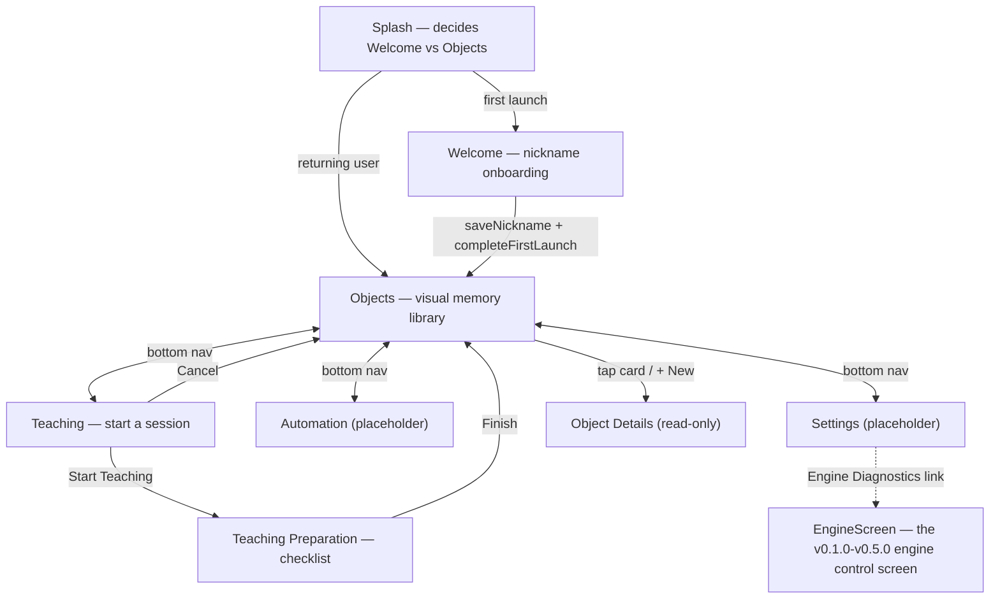
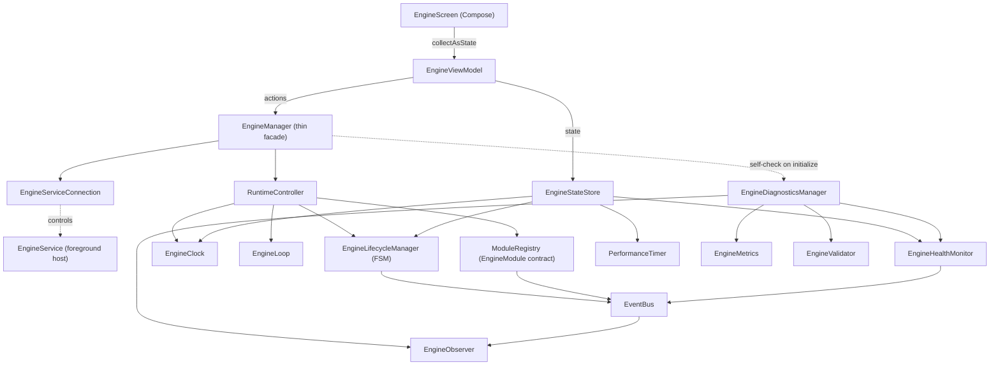

# Behavior Engine — v0.8.0 Teaching Workflow

A Visual Behavior Engine for Android. v0.1.0–v0.5.0 built and froze the engine; v0.6.0 built
onboarding and the navigation shell; v0.7.0 gave the product its taught-object library ("Visual
Objects"). **v0.8.0 prepares the complete teaching workflow**: a user can now start a teaching
session for an object and watch it move through preparation — still no image capture, no
recognition, no screen recording permission request, no AI. Only the lifecycle those features
will eventually plug into.

## Opening the project

This project was generated outside Android Studio, so the Gradle wrapper's binary launcher
(`gradle/wrapper/gradle-wrapper.jar`, `gradlew`, `gradlew.bat`) is not included — binary files
can't be authored as text. `gradle/wrapper/gradle-wrapper.properties` already pins the intended
version (Gradle 8.9). Regenerate the launcher one of two ways:

1. Open the project in a recent Android Studio (Ladybird/Meerkat or newer) — it detects the
   missing wrapper and offers to generate it automatically on sync.
2. Or, with a local Gradle install: `gradle wrapper --gradle-version 8.9` from the project root.

Requires JDK 17 and Android SDK Platform 35 (installed via Android Studio's SDK Manager).

## Product navigation flow (changed in v0.8.0)



**The v0.6.0 "Home" hub is gone.** Its only job was navigation, and a persistent bottom bar
(Objects/Teaching/Automation/Settings) is a strictly better fit for "the user should land in the
Objects workspace, not a menu screen" — so rather than preserve it the way `EngineScreen` was
preserved (which had substantial *tested behavior* worth keeping), it was removed outright.
`BehaviorEngineNavGraph` wraps the whole `NavHost` in a `Scaffold`; the bottom bar renders itself
only for `Screen.BOTTOM_NAV_ROUTES` — Splash, Welcome, Object Details, and Engine Diagnostics are
all full-screen with no bottom bar.

## The Visual Object architecture

```
core.domain.objects.VisualObject           // id, name, created/modified, status, imageCount,
                                            // recognitionEnabled, notes, reserved (AI metadata)
core.domain.objects.VisualObjectStatus     // READY / DISABLED / TRAINING / ARCHIVED
core.domain.objects.VisualObjectRepository // createObject/updateObject/deleteObject/loadObjects/searchObjects
core.data.objects.VisualObjectRepositoryImpl // in-memory only — see below
```

**In-memory, not persisted, on purpose.** This phase's spec says "prepare repository
architecture... use mock local data if necessary" — there's no image data yet to make real
persistence meaningful, and the empty-state test case (`Navigate to Objects. Empty state should
appear.`) requires the library start empty every launch anyway. A future phase backing this with
Room only has to change `VisualObjectRepositoryImpl`; every screen already goes through the
`VisualObjectRepository` interface.

`VisualObject` is `@Immutable`-annotated: without it, Compose's stability inference would flag
the class unstable purely because `reserved` is a `Map`, forcing unnecessary recomposition of
every card in `ObjectsScreen`'s `LazyColumn` on unrelated state changes. The annotation is honest
here — every mutation goes through the repository, which always publishes a new instance via
`copy()`. `kotlinx.collections.immutable` (for the `List<VisualObject>` itself) was deliberately
*not* added — `LazyColumn`'s stable `key = { it.id }` already covers this phase's real (near-zero)
scale; reaching for that library is a future option once profiling shows it matters, not a
default to apply pre-emptively.

## Objects screen

Top bar (title + subtitle), an always-visible search field, and either a premium empty state or a
`LazyColumn` of cards:

- **Empty**: a tinted circle behind an outlined icon standing in for a real illustration, copy
  drawn from the product vision ("build your own visual library") rather than a generic
  "nothing here," and a primary "New Visual Object" button.
- **Populated**: `ObjectCard` per object (name, `StatusBadge`, image count, created date,
  three-dot menu), plus a `FloatingActionButton` for adding more. Card press elevation uses
  Material3's built-in `pressedElevation` — no manual animation code needed for this phase's
  "small card elevation animation" spec point.

Object creation has no form yet: tapping "New Visual Object" creates one immediately (name
`"Visual Object #N"`) and navigates straight to its (read-only) details screen — matching the
literal test case ("Press New Visual Object → Navigate to Object Details placeholder") without
inventing a creation form the spec never asked for. The three-dot menu's "Edit" also navigates
there for the same reason: Object Details is the only "manage this object" destination that
exists yet. "Disable" is a toggle (relabels to "Enable" once disabled) rather than one-directional,
since a menu action with no way back would feel broken. Delete asks for confirmation first.

Status → color mapping (`core.presentation.common.VisualObjectStatusUi.kt`) is the one place
this can ever be defined, shared by `ObjectCard` and `ObjectDetailsScreen`:
`READY`→green, `TRAINING`→yellow, `DISABLED`→gray, `ARCHIVED`→red — exactly the four colors this
phase's spec allows.

## The teaching workflow (v0.8.0)

```
core.domain.teaching.TeachingSession     // sessionId, objectId, created, status, capturedSamples, reserved
core.domain.teaching.TeachingStatus      // CREATED/PREPARING/READY/RUNNING/PAUSED/STOPPED/FINISHED/CANCELLED
core.domain.teaching.TeachingManager     // create/start/pause/resume/finish/cancel/destroy — lifecycle only
core.domain.teaching.TeachingRepository  // save/load/delete — sessions IS the session history
core.data.teaching.TeachingManagerImpl   // writes through to the repository on every transition
core.data.teaching.TeachingRepositoryImpl // in-memory only, same reasoning as VisualObjectRepositoryImpl
```

**Lifecycle only, on purpose.** This phase explicitly forbids capture, recognition, and screen
recording — `TeachingManager` only ever moves `TeachingSession.status` forward
(`CREATED → PREPARING → FINISHED`, or `→ CANCELLED`), it never touches pixels. A future phase
wiring in the real capture engine only has to teach `startSession` to do more than flip a status.

**No object picker.** The spec's flow is "Choose Object → Start Teaching," but this phase's file
list doesn't include a picker UI — `TeachingViewModel.selectedObject` is simply the first object in
`VisualObjectRepository.objects`, since that library (built in v0.7.0) is the only source of
objects to teach. If none exist yet, the Teaching screen says so and disables "Start Teaching"
rather than crashing on a null object.

**Teaching Preparation's checklist is static.** "Object Selected" and "Session Created" are always
checked by the time that screen can show; "Waiting for Screen Capture Permission" and "Waiting for
Capture Engine" are permanently unchecked placeholders for the phases that build those systems. The
large `CircularProgressIndicator` doubles as the spec's "Large Icon" and "Loading animation" —
one Material3 primitive satisfies both requirements without inventing a custom asset.

**"Finish" and "Cancel" both return to the Objects tab** using the exact same
`popUpTo(startDestination) { saveState = true } / launchSingleTop / restoreState` navigation used
by the bottom bar itself (factored into `navigateToObjectsTab` in `BehaviorEngineNavGraph`) — "the
user is always in control" applies as much to backing out mid-flow as it does to finishing it.

## Engine architecture (unchanged since v0.5.0)



## Package structure

```
com.behaviorengine
├── core
│   ├── common          // App-wide infra: AppConstants, LoggerManager, ConfigManager
│   ├── data
│   │   ├── profile      // UserProfileRepositoryImpl (DataStore)
│   │   ├── objects      // VisualObjectRepositoryImpl (in-memory)
│   │   └── teaching     // TeachingManagerImpl, TeachingRepositoryImpl (in-memory)
│   ├── domain
│   │   ├── engine       // Every engine contract (unchanged since v0.5.0)
│   │   ├── profile      // UserProfile, UserProfileRepository
│   │   ├── objects      // VisualObject, VisualObjectStatus, VisualObjectRepository
│   │   └── teaching     // TeachingSession, TeachingStatus, TeachingManager, TeachingRepository
│   └── presentation
│       ├── splash       // Routing: Welcome vs Objects
│       ├── welcome      // Onboarding
│       ├── objects      // The visual memory library (ObjectsViewModel/Screen/Card/EmptyView)
│       ├── objectdetails// Read-only object details
│       ├── teaching     // Start-a-session screen (TeachingViewModel/Screen)
│       ├── teachingpreparation // Checklist screen (TeachingPreparationViewModel/Screen)
│       ├── automation   // Placeholder
│       ├── settings     // Placeholder + Engine Diagnostics link
│       ├── engine       // EngineScreen/EngineViewModel (the old engine control screen)
│       └── common       // PlaceholderScreen, InfoRow, StatusBadge, VisualObjectStatusUi
├── engine               // Concrete implementations of every core.domain.engine interface
├── vision               // (future) screen capture / frame acquisition
├── recognition          // (future) OCR + visual element recognition
├── world                // (future) structured "what's on screen" model
├── behavior             // (future) rules / actions / feedback
├── memory               // (future) persisted history for learning to train on
├── learning             // (future) adapts rules/decisions over time
├── automation           // (future) executes actions against the device
├── accessibility        // (future) AccessibilityService integration
├── services             // EngineService (foreground host)
├── settings             // AppSettings model + DataStore prep (distinct from profile)
├── utils                // Time/number/date formatting helpers
├── di                   // Hilt modules + qualifiers
├── navigation           // Nav graph, route definitions, bottom bar
└── ui/theme             // Compose dark theme, typography, color tokens
```

## What's deliberately not here

Image processing, recognition, AI, object detection, Accessibility, screen capture, and
MediaProjection are all still out of scope. So is any editing UI for a `VisualObject` (rename,
notes, image management) — Object Details is read-only per this phase's spec; so is real
persistence for the object library, per the reasoning above. v0.8.0 adds the teaching *lifecycle*
only — no image capture, no screen recording permission request, no object picker UI, and no
persistence for `TeachingSession` either, matching `VisualObjectRepositoryImpl`'s reasoning.
