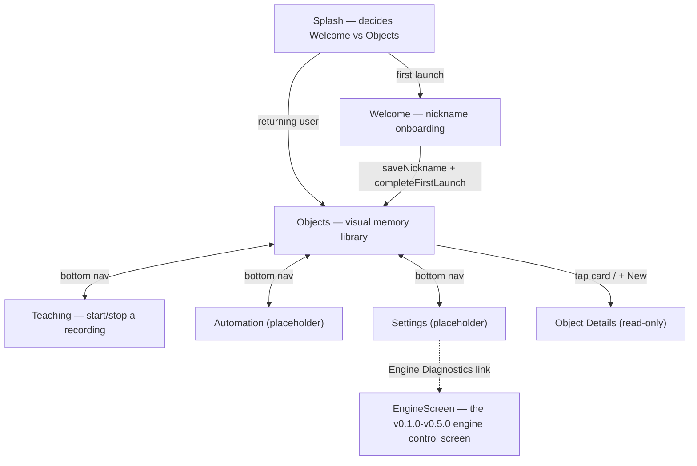
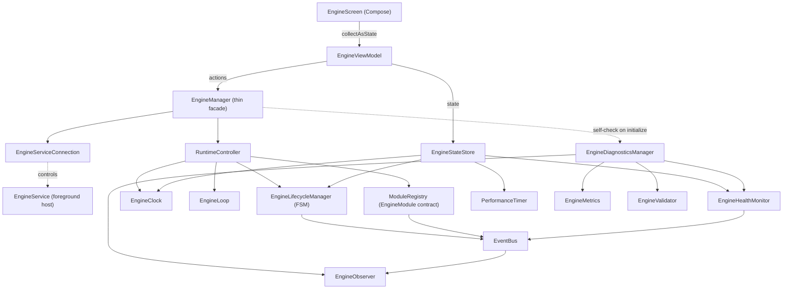

# Behavior Engine — v0.11.0 Intelligent Visual Matching Engine

A Visual Behavior Engine for Android. v0.1.0–v0.5.0 built and froze the engine; v0.6.0 built
onboarding and the navigation shell; v0.7.0 gave the product its taught-object library ("Visual
Objects"); v0.8.0 built a lifecycle-only teaching session placeholder; v0.9.0 replaced it with real
`MediaProjection` screen recording; v0.10.0 turned that raw recording into a library of
`ObjectTemplate`s (crop, mask, measure, OCR — automatically, the moment a teaching session
finishes). **v0.11.0 (SPEC-11) closes the loop**: given any `ObjectTemplate`, the new Intelligent
Visual Matching Engine (IVME) searches a live screen capture and returns its most probable
location and a 0–100% confidence, without relying on fixed coordinates — tolerant of a different
resolution, a moved/resized element, or light vs. dark theme. IVME only *locates* objects; it still
performs no clicks, taps, or automation of any kind.

## Opening the project

This project was generated outside Android Studio, so the Gradle wrapper's binary launcher
(`gradle/wrapper/gradle-wrapper.jar`, `gradlew`, `gradlew.bat`) is not included — binary files
can't be authored as text. `gradle/wrapper/gradle-wrapper.properties` already pins the intended
version (Gradle 8.9). Regenerate the launcher one of two ways:

1. Open the project in a recent Android Studio (Ladybird/Meerkat or newer) — it detects the
   missing wrapper and offers to generate it automatically on sync.
2. Or, with a local Gradle install: `gradle wrapper --gradle-version 8.9` from the project root.

Requires JDK 17 and Android SDK Platform 35 (installed via Android Studio's SDK Manager).

## Product navigation flow (changed in v0.9.0)



Unlike v0.8.0, Teaching no longer navigates to a separate screen when a recording starts — the
same `TeachingScreen` just changes what it shows (idle explanation vs. live stats), since starting
a screen recording is not itself a "detail" destination to drill into.

**The v0.6.0 "Home" hub is gone.** Its only job was navigation, and a persistent bottom bar
(Objects/Teaching/Automation/Settings) is a strictly better fit for "the user should land in the
Objects workspace, not a menu screen" — so rather than preserve it the way `EngineScreen` was
preserved (which had substantial *tested behavior* worth keeping), it was removed outright.
`BehaviorEngineNavGraph` wraps the whole `NavHost` in a `Scaffold`; the bottom bar renders itself
only for `Screen.BOTTOM_NAV_ROUTES` — Splash, Welcome, Object Details, and Engine Diagnostics are
all full-screen with no bottom bar.

## The Visual Object architecture

```
core.domain.objects.VisualObject           // id, name, created/modified, status, imageCount,
                                            // recognitionEnabled, notes, reserved (AI metadata)
core.domain.objects.VisualObjectStatus     // READY / DISABLED / TRAINING / ARCHIVED
core.domain.objects.VisualObjectRepository // createObject/updateObject/deleteObject/loadObjects/searchObjects
core.data.objects.VisualObjectRepositoryImpl // in-memory only — see below
```

**In-memory, not persisted, on purpose.** This phase's spec says "prepare repository
architecture... use mock local data if necessary" — there's no image data yet to make real
persistence meaningful, and the empty-state test case (`Navigate to Objects. Empty state should
appear.`) requires the library start empty every launch anyway. A future phase backing this with
Room only has to change `VisualObjectRepositoryImpl`; every screen already goes through the
`VisualObjectRepository` interface.

`VisualObject` is `@Immutable`-annotated: without it, Compose's stability inference would flag
the class unstable purely because `reserved` is a `Map`, forcing unnecessary recomposition of
every card in `ObjectsScreen`'s `LazyColumn` on unrelated state changes. The annotation is honest
here — every mutation goes through the repository, which always publishes a new instance via
`copy()`. `kotlinx.collections.immutable` (for the `List<VisualObject>` itself) was deliberately
*not* added — `LazyColumn`'s stable `key = { it.id }` already covers this phase's real (near-zero)
scale; reaching for that library is a future option once profiling shows it matters, not a
default to apply pre-emptively.

## Objects screen

Top bar (title + subtitle), an always-visible search field, and either a premium empty state or a
`LazyColumn` of cards:

- **Empty**: a tinted circle behind an outlined icon standing in for a real illustration, copy
  drawn from the product vision ("build your own visual library") rather than a generic
  "nothing here," and a primary "New Visual Object" button.
- **Populated**: `ObjectCard` per object (name, `StatusBadge`, image count, created date,
  three-dot menu), plus a `FloatingActionButton` for adding more. Card press elevation uses
  Material3's built-in `pressedElevation` — no manual animation code needed for this phase's
  "small card elevation animation" spec point.

Object creation has no form yet: tapping "New Visual Object" creates one immediately (name
`"Visual Object #N"`) and navigates straight to its (read-only) details screen — matching the
literal test case ("Press New Visual Object → Navigate to Object Details placeholder") without
inventing a creation form the spec never asked for. The three-dot menu's "Edit" also navigates
there for the same reason: Object Details is the only "manage this object" destination that
exists yet. "Disable" is a toggle (relabels to "Enable" once disabled) rather than one-directional,
since a menu action with no way back would feel broken. Delete asks for confirmation first.

Status → color mapping (`core.presentation.common.VisualObjectStatusUi.kt`) is the one place
this can ever be defined, shared by `ObjectCard` and `ObjectDetailsScreen`:
`READY`→green, `TRAINING`→yellow, `DISABLED`→gray, `ARCHIVED`→red — exactly the four colors this
phase's spec allows.

## Teaching Mode architecture (v0.9.0)

```
core.domain.teaching.TeachingState            // Idle/Preparing/Recording/Paused/Stopping/Completed/Cancelled
core.domain.teaching.TeachingSession          // device/screen metadata, timing, running frame/touch counts
core.domain.teaching.TouchSample              // one collected touch — real MotionEvent fields
core.domain.teaching.ScreenFrame               // one captured frame's metadata (imagePath, never pixels)
core.domain.teaching.TeachingModeManager      // start/pause/resume/stop/cancel — top-level orchestrator
core.domain.teaching.SessionManager           // session lifecycle + device metadata, wraps TeachingRepository
core.domain.teaching.ScreenCaptureManager     // MediaProjection lifecycle + the 2 FPS capture loop
core.domain.teaching.TouchCollectorManager    // builds TouchSamples from MotionEvents
core.domain.teaching.OverlayManager           // the floating WindowManager overlay
core.domain.teaching.TeachingRecorder         // wires capture/touch streams into TeachingRepository
core.domain.teaching.TeachingRepository       // sessions/touches/frames read+write, backed by TeachingStorage
core.domain.teaching.TeachingStorage          // JSON+WEBP file I/O — the bottom layer
core.domain.teaching.TeachingServiceConnection // starts/stops TeachingOverlayService
core.data.teaching.*Impl                      // real implementations of all of the above
vision.ScreenCaptureManagerImpl               // the actual MediaProjection/VirtualDisplay/ImageReader code
services.TeachingOverlayService               // foreground host, type "mediaProjection"
core.common.TeachingLogger                    // named teaching log events, funneled through LoggerManager
```

**"UI → Manager → Repository → Storage → JSON Database," exactly as spec'd.**
`TeachingViewModel` only ever calls `TeachingModeManager`; that manager coordinates
`SessionManager`, `ScreenCaptureManager`, `TouchCollectorManager`, `OverlayManager`, and
`TeachingRecorder` — mirroring how `EngineManager` coordinates the engine's own subsystems without
any of them needing to know about each other.

**Only starting a recording needs the foreground service.** Android 14+ requires
`MediaProjectionManager.getMediaProjection()` to be called only while a `mediaProjection`-typed
foreground service is already promoted, so `TeachingOverlayService.onStartCommand` does exactly
that one thing (`startForeground` then `startProjection`) before handing off to the same
singleton managers `TeachingModeManagerImpl` uses everywhere else. Pause/resume/stop/cancel call
straight into those managers with no Service involved at all — there's no Android constraint on
those calls, so routing them through the Service would just be indirection for its own sake.

**`currentSession`/`currentState` are derived, never separately mutated.** `TeachingModeManagerImpl`
tracks only "which session id is current"; both StateFlows are `combine()`d from
`TeachingRepository.sessions` (which every real mutation writes through). Whichever component
actually changes something — the Service starting capture, or the manager pausing it — the UI and
the overlay can never observe a stale state, because there's only one source of truth to read from.

**Touch collection is honestly scoped to the overlay's own controls.** Capturing raw touch
coordinates system-wide, on whatever app the user is teaching on, needs either root, a
system-signature permission, or (Android 14+) an `AccessibilityService` declaring
`FLAG_REQUEST_MOTION_EVENTS` — none of which are in this phase's permission list, and the last one
needs a manual user opt-in in system Accessibility settings this spec never mentions. Every touch
this phase *does* collect (dragging the overlay bubble, tapping its Pause/Stop/Cancel buttons) is
a completely real `MotionEvent` — genuine pressure, size, pointer count, action — written straight
to `session.json`. A future phase adding system-wide capture only has to feed more samples through
the same `TouchCollectorManager.recordTouch`, per the "modular... without refactoring" requirement.

**Frames are written to disk immediately, never buffered in memory.** `ScreenCaptureManagerImpl`
captures a `VirtualDisplay`/`ImageReader` frame every 500ms, converts it to WEBP
(`Bitmap.CompressFormat.WEBP_LOSSY` on API 30+, legacy `WEBP` below that), and every `Bitmap`
created along the way is `recycle()`d before the function returns — nothing here accumulates.
`TeachingRepository` only ever keeps *metadata* (`ScreenFrame`, no pixels) in memory per session.

**Storage lives at `getExternalFilesDir(null)/Teaching/`** — scoped-storage compliant, no
`MANAGE_EXTERNAL_STORAGE` needed, mirroring the spec's requested `Android/data/<package>/Teaching/`
layout as closely as a modern non-rooted app is allowed to: `Sessions/<id>/session.json`,
`Frames/<id>/frame_00001.webp` etc., `Json/` reserved for a future cross-session index, `Temp/`
used for an atomic write-then-rename so a process death mid-write can never corrupt `session.json`.

**Three permission gates, each requested only when needed.** `TeachingScreen` checks
`Settings.canDrawOverlays()` (re-checked on `ON_RESUME`, since granting it happens in a separate
Settings screen), then `POST_NOTIFICATIONS` on API 33+, then finally launches the system
`MediaProjection` consent dialog — denying any of them shows an explanation instead of crashing.

**`packageName`/`applicationName` are a best-effort guess.** Reliably knowing which app is in the
foreground system-wide needs `PACKAGE_USAGE_STATS`, a separate special permission this phase
doesn't require; `SessionManagerImpl` checks whether the user has separately granted Usage Access
and falls back to this app's own package/label when they haven't, rather than guessing wrong.

## Smart Object Learning Engine (v0.10.0)

```
core.domain.objectlearning.BoundingBox           // left/top/right/bottom pixel rect, padding/distance helpers
core.domain.objectlearning.DetectionMethod       // the 5-tier priority order, tried in this order
core.domain.objectlearning.DetectionCandidate    // one tier's proposed bounding box + confidence
core.domain.objectlearning.VisualFeatures        // everything measured from one cropped object
core.domain.objectlearning.OcrResult             // recognized text + language + bounding box
core.domain.objectlearning.ObjectTemplate        // the persisted, reusable template (feature.json)
core.domain.objectlearning.LearnedObject         // links one touch to the template learned from it
core.domain.objectlearning.LearningProgress      // "Processing Session..." UI state
core.domain.objectlearning.FrameSelectionManager // closest-frame-to-touch lookup, ≤100ms tolerance
core.domain.objectlearning.ObjectDetectionManager// the 5-tier detector chain
core.domain.objectlearning.CropManager           // crop + background-subtraction mask
core.domain.objectlearning.FeatureExtractionManager // pixel measurements — see below
core.domain.objectlearning.OCRManager            // ML Kit text recognition + language ID
core.domain.objectlearning.ObjectTemplateManager // merges features + OCR into one ObjectTemplate
core.domain.objectlearning.ObjectRepository      // sessions/templates/objects read+write
core.domain.objectlearning.ObjectLearningStorage // JSON+WEBP+PNG file I/O — the bottom layer
core.domain.objectlearning.ObjectLearningManager // top-level orchestrator
core.data.objectlearning.*Impl                   // real implementations of all of the above
objectlearning.ObjectDetectionManagerImpl        // ML Kit + hand-rolled contour/edge/fallback tiers
objectlearning.OCRManagerImpl                    // ML Kit Text Recognition + Language ID
core.common.ObjectLearningLogger                 // named log events, funneled through LoggerManager
```

**Triggered automatically, not manually.** There's no session-history/picker UI yet, so
`TeachingViewModel.onFinishClicked` hands the just-finished session straight to
`ObjectLearningManager.startLearning` — the natural, lowest-friction reading of "at the end of
teaching, learn objects from it." Only Finish does this, not Cancel: a cancelled recording is
data the user explicitly chose to discard, matching v0.9.0's "keep the files, don't force an
opinion on them" stance for Cancel while not forcing a processing pass on data the user didn't
want. `TeachingScreen` gains a third state (`isLearning`) alongside idle/active, showing the
spec's "Processing Session... Touch X/Y, Objects Learned, Current Confidence, Estimated Remaining
Time" — no new nav route needed, exactly how idle/active already share one screen.

**Real ML Kit for detection and OCR; hand-rolled pixel algorithms for the rest.** Tier 2
(`ML_KIT_OBJECT_DETECTION`) and OCR both use bundled on-device ML Kit models — genuine, no
placeholders. Tiers 3/4 ("Contour Detection"/"Edge Detection" in the spec) are real, distinct pixel
algorithms — a local-window flood-fill segmentation and a four-direction Sobel edge-boundary
trace — deliberately *not* OpenCV, whose Android artifact bundles native `.so` libraries this
project has no way to verify across ABIs without significant added risk for a pure-Kotlin
alternative that solves the same "find a bounding box around the touch point" problem. Tier 1
(`ACCESSIBILITY_NODE`) never actually produces a candidate: object learning processes *completed*
sessions after the fact, from a saved screenshot — there is no live `AccessibilityNodeInfo` tree to
query for a touch that already happened, regardless of whether an `AccessibilityService` exists.
Tier 5 (a fixed box around the touch point) always succeeds with a confidence deliberately below
the 70% quality gate, so a blind guess can never look as trustworthy as a real detection.

**`VisualFeatures.cornerFeatureCount` and `.shapeDescriptor` are honest simplifications**, not
placeholders: real ORB descriptor extraction and true shape descriptors (Hu moments, Fourier
descriptors) need OpenCV too. `cornerFeatureCount` is a genuine FAST-style corner-response count
(pixels where both Sobel gradients are individually strong); `shapeDescriptor` is the mask's real
fill ratio. `visualHash` (a genuine 64-bit difference-hash), `dominantColors`, `averageBrightness`,
and `edgeDensity` are all fully real, unsimplified measurements — useful today for a future
duplicate-detection pass, not waiting on a library this project doesn't have.

**Quality rules reject one touch, never the whole session** — confidence below 70%, a crop under
24px, a corrupted image, or no frame within 100ms all just skip that touch and move on, logged as
a warning; `processSession` still reports `Learning completed` at the end either way, per "never
block UI."

**Resuming needs no separate progress file.** `processSession` fetches
`ObjectRepository.getObjectsForSession` up front and skips any touch that already produced a
`LearnedObject` — calling `startLearning` again for a session that was stopped or killed mid-run
naturally continues from where it left off.

**Storage extends the same `Teaching/` root** v0.9.0 already owns, adding `Objects/` (one
`.webp` + one `.json` per learned object), `Templates/` and `Features/` (each holding a copy of
every `ObjectTemplate` as `feature.json` — same content, different folders, matching the spec's
literal storage layout), and `Masks/` (`.png`, lossless, since a binary mask benefits from that
more than WEBP's lossy compression).

## Intelligent Visual Matching Engine (v0.11.0)

```
core.domain.matching.MatchResult            // templateId/confidence/boundingBox/center/scale/method/quality — the final output
core.domain.matching.MatchQuality           // MATCH (≥85%) / POSSIBLE_MATCH (70-84%) — <70% is rejected before a MatchResult exists
core.domain.matching.CandidateRegion        // one screen region worth full matching — x/y/width/height/priority/score
core.domain.matching.MatchingStatistics     // one search's performance record, for MatchingRepository
core.domain.matching.AnalyzedScreen/ScreenAnalyzer   // contrast-normalized grayscale + the raw color bitmap
core.domain.matching.CandidateSearchEngine  // cache + OCR-region + edge/color grid scan → CandidateRegions
core.domain.matching.MultiScaleMatcher      // 11 search-window scales per candidate, cheap dHash pass
core.domain.matching.FeatureMatcher         // reuses FeatureExtractionManager on the winning-scale crop
core.domain.matching.OCRMatcher             // reuses OCRManager + Levenshtein text similarity
core.domain.matching.ContextAnalyzer        // positional-consistency check against ObjectTemplate.screenPositionX/Y
core.domain.matching.ConfidenceEngine       // weighted 0-100 combine (Visual 45 / Shape 20 / OCR 15 / Color 10 / Context 10)
core.domain.matching.MatchingCache          // in-memory last-known-location cache, TTL-expired
core.domain.matching.MatchingRepository     // statistics/history read+write, backed by MatchingStorage
core.domain.matching.MatchingStorage        // JSON file I/O — its own Matching/ root
core.domain.matching.VisualMatchingManager  // top-level orchestrator — findObject/findAllObjects/cancel/clearCache
core.domain.matching.DebugOverlayManager    // WindowManager bounding-box+confidence overlay, debug builds only
core.domain.matching.MatchingServiceConnection // starts/stops VisualMatchingService
core.data.matching.*Impl                    // real implementations of all of the above
core.presentation.matching                  // MatchingDebugViewModel/Screen — Settings → "Visual Matching Debug"
services.VisualMatchingService              // foreground host, type "mediaProjection", mirrors TeachingOverlayService
core.common.MatchingLogger                  // named log events, funneled through LoggerManager
```

**Pipeline, exactly as spec'd**: `ScreenAnalyzer → CandidateSearchEngine → MultiScaleMatcher →
FeatureMatcher/OCRMatcher → ContextAnalyzer → ConfidenceEngine → MatchResult`, orchestrated by
`VisualMatchingManagerImpl.searchAnalyzed()`, capped at a 300ms budget via `withTimeoutOrNull` — a
`var best` mutated *outside* that block from inside it survives a mid-loop cancellation, so "return
the best available result on timeout" (per spec) falls out of normal coroutine semantics rather
than needing separate timeout-handling code.

**"Multi-scale" means the sampled search window, not the template.** For each candidate region and
each of the 11 required scale levels (50%–200%), `MultiScaleMatcherImpl` samples a
`templateWidth*scale x templateHeight*scale` window from the live screen centered on the candidate,
resizes *that* down/up to the template's exact original size, then compares perceptual hashes — so
a UI element taught at one size is still found correctly whether the live screen renders it larger,
smaller, or at a different density/resolution, without ever resizing the template itself.

**Feature matching reuses v0.10.0's `FeatureExtractionManager` rather than re-implementing pixel
measurement.** The winning-scale crop gets a synthetic fully-opaque mask (a live screen crop has no
segmentation mask the way a taught object does) and is run through the exact same
`extractFeatures()` v0.10.0 used to build the template in the first place — guaranteeing the two
sides of every comparison (`visualHash`, `dominantColors`, `edgeDensity`, `shapeDescriptor`,
`aspectRatio`) are computed identically. OCR matching similarly reuses `OCRManager`, adding only
normalized Levenshtein text similarity on top.

**Light/dark theme tolerance comes from relative comparisons, not a separate normalization step.**
Every signal used (perceptual hash, edge density, dominant-color *distance*, shape) already
compares pixel *structure*, not absolute brightness — `ScreenAnalyzer` only contrast-stretches the
grayscale copy used for candidate search, leaving the color bitmap untouched for accurate dominant-
color comparison. There is no separate "invert for dark mode" step because none of the actual
scoring needs one.

**Candidate search is a bounded heuristic, not a full-screen scan.** Running 11-scale matching over
every pixel of a 1080×2400 screen is not feasible in pure Kotlin inside a 300ms budget, so
`CandidateSearchEngineImpl` first narrows the field: the template's last successful location
(`MatchingCache`), one OCR pass over the whole screen when the template has text, and a grid scan
(sized to the template's own dimensions, 50% stride) scored by edge density and dominant-color
similarity — capped at 20 total candidates, highest-priority first. This is the same
dependency-free, honest-approximation philosophy v0.10.0 already established for detection
(no OpenCV, no trained saliency model) — see that section above.

**`ObjectTemplate` gained two optional fields for `ContextAnalyzer`**: `screenPositionX`/
`screenPositionY`, the object's normalized (0..1) position within the frame it was taught on,
populated by `ObjectTemplateManagerImpl` at learning time. Templates learned before v0.11.0 default
to `-1f` (an explicit "unknown" sentinel, not `0`/top-left) and `ContextAnalyzer` returns a neutral
0.5 score for them rather than falsely penalizing older templates. `ContextAnalyzer` is honestly
scoped to *positional* consistency only — comparing where a candidate sits on today's screen
against where the object was originally taught — not the spec's fuller "neighbor objects / layout
graph" comparison, which would need re-running detection across the whole live screen to find and
match individual neighboring elements, out of scope for this phase.

**`MatchingCache` is in-memory only, deliberately.** A cache surviving process death would need
revalidating against a live screen anyway (the UI may have changed since the app last ran), so
nothing is gained by persisting it; durable match history/statistics already live in
`MatchingRepository`'s own `Matching/{Statistics,History}` JSON store — a new root folder, sibling
to `Teaching/`, since matching output isn't teaching-pipeline data.

**Screen capture reuses the same `ScreenCaptureManager` singleton Teaching Mode uses**, rather than
forking a separate capture path. Starting a `MediaProjection` needs a foreground service and fresh
user consent — Android's requirement, not this project's choice — so `VisualMatchingService` mirrors
`TeachingOverlayService` (foreground promotion, then `startProjection`) to let the debug screen
exercise IVME standalone; if Teaching's own projection happens to already be active, `isCapturing`
is already `true` and no second consent prompt is shown.

**The debug screen and overlay are the spec's required deliverables, not a bonus feature.**
Settings → "Visual Matching Debug" starts capture, lists every taught object, runs `findObject()`
against the live screen on tap, and shows confidence/quality/scale/method/processing time exactly
as the spec's "debugging screen" section lists. The optional bounding-box overlay
(`DebugOverlayManagerImpl`, a plain `View`/`Canvas` `WindowManager` window — same reasoning as
`OverlayManagerImpl`'s KDoc for why not `ComposeView`) is a toggle on that screen; nothing gates it
to debug builds at the manifest/service level since this whole screen is already unreachable from
the product's main flow.

## Engine architecture (unchanged since v0.5.0)



## Package structure

```
com.behaviorengine
├── core
│   ├── common          // App-wide infra: AppConstants, LoggerManager, ConfigManager
│   ├── data
│   │   ├── profile      // UserProfileRepositoryImpl (DataStore)
│   │   ├── objects      // VisualObjectRepositoryImpl (in-memory)
│   │   ├── teaching     // Real impls of every core.domain.teaching manager/repository/storage
│   │   ├── objectlearning // Real impls of every core.domain.objectlearning contract (v0.10.0)
│   │   └── matching     // Real impls of every core.domain.matching contract (v0.11.0 / SPEC-11)
│   ├── domain
│   │   ├── engine       // Every engine contract (unchanged since v0.5.0)
│   │   ├── profile      // UserProfile, UserProfileRepository
│   │   ├── objects      // VisualObject, VisualObjectStatus, VisualObjectRepository
│   │   ├── teaching     // TeachingSession/TouchSample/ScreenFrame + every manager contract
│   │   ├── objectlearning // ObjectTemplate/LearnedObject + every learning-manager contract (v0.10.0)
│   │   └── matching     // MatchResult/CandidateRegion + every IVME pipeline-stage contract (v0.11.0)
│   └── presentation
│       ├── splash       // Routing: Welcome vs Objects
│       ├── welcome      // Onboarding
│       ├── objects      // The visual memory library (ObjectsViewModel/Screen/Card/EmptyView)
│       ├── objectdetails// Read-only object details
│       ├── teaching     // Teaching Mode screen (TeachingViewModel/Screen) — idle/active/learning states
│       ├── matching     // Visual Matching debug screen (MatchingDebugViewModel/Screen) — v0.11.0
│       ├── automation   // Placeholder
│       ├── settings     // Placeholder + Engine Diagnostics / Visual Matching Debug links
│       ├── engine       // EngineScreen/EngineViewModel (the old engine control screen)
│       └── common       // PlaceholderScreen, InfoRow, StatusBadge, VisualObjectStatusUi
├── engine               // Concrete implementations of every core.domain.engine interface
├── vision               // ScreenCaptureManagerImpl — MediaProjection/VirtualDisplay/ImageReader (v0.9.0)
├── objectlearning        // ObjectDetectionManagerImpl + OCRManagerImpl — the ML Kit-heavy code (v0.10.0)
├── recognition          // (future, still unbuilt) — IVME (v0.11.0) landed under core.domain/data.matching instead, mirroring objectlearning's own Clean Architecture package pair rather than this reserved-but-empty slot
├── world                // (future) structured "what's on screen" model
├── behavior             // (future) rules / actions / feedback
├── memory               // (future) persisted history for learning to train on
├── learning             // (future) adapts rules/decisions over time
├── automation           // (future) executes actions against the device — IVME (v0.11.0) only *locates*, this still performs no clicks
├── accessibility        // (future) AccessibilityService integration
├── services             // EngineService + TeachingOverlayService + VisualMatchingService (foreground hosts)
├── settings             // AppSettings model + DataStore prep (distinct from profile)
├── utils                // Time/number/date formatting helpers
├── di                   // Hilt modules + qualifiers
├── navigation           // Nav graph, route definitions, bottom bar
└── ui/theme             // Compose dark theme, typography, color tokens
```

## What's deliberately not here

**v0.11.0**: IVME only *locates* — "this module does NOT perform clicks or automation," per spec;
`com.behaviorengine.automation` stays empty/reserved for whatever future phase actually acts on a
`MatchResult`. Candidate search is a bounded heuristic (cache + one OCR pass + an edge/color-scored
grid, capped at 20 regions), not a literal implementation of the spec's "visual saliency" — there's
no trained saliency model in this dependency-free project, matching v0.10.0's same stance on ORB/
OpenCV. `ContextAnalyzer` only checks positional consistency, not a full neighbor-object/layout
graph (that needs re-running detection across the whole live screen, out of scope this phase).
`MatchingCache` is process-lifetime only, never persisted (see above for why). There's no debug-UI
history browser for `MatchingRepository`'s saved statistics/match history yet — the data is written
correctly, just not surfaced beyond the current search's live result.

**v0.10.0**: template *matching* was out of scope then — closed by v0.11.0/SPEC-11 above. There's
still no session-history/picker UI (see above for why that doesn't block learning); learned objects
still aren't linked to a specific `VisualObject` — `LearnedObject` only references the
session/touch/frame it came from, since there's no UI yet for the user to say "these objects are
the same thing I taught earlier."

**v0.7.0/v0.8.0, unchanged**: image recognition, AI analysis, automation, auto-click, and
Accessibility actions are all still out of scope app-wide. There's still no editing UI for a
`VisualObject` (rename, notes, image management) — Object Details is read-only; there's still no
real persistence for the object library either. Touch collection stays scoped to the teaching
overlay's own controls rather than system-wide, per v0.9.0's reasoning.
